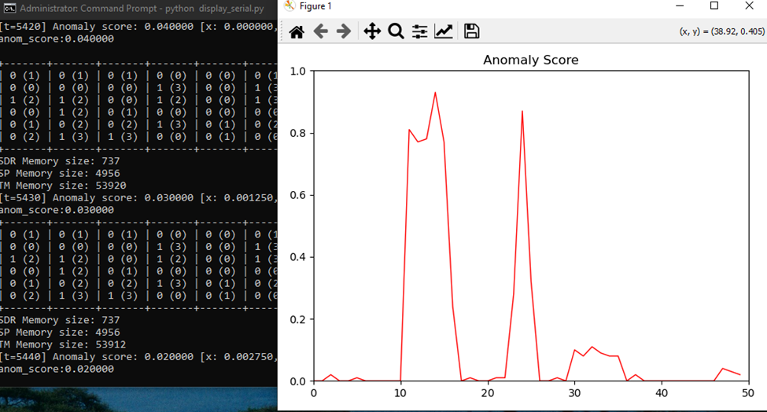

# IMU Anomaly Detection Example

This example shows how to use the Hierarchical Temporal Memory component to detect anomalies on a stream of data from the accelerometer. The algorithm is configured to be very sensitive to anomalies, so it will detect even small changes in the data. This means that if you personally move the board around, you will constantly have a high anomaly score due to the randomness in your movements.

To get the most out of this example application, you can try to move the board in a way that is not random, e.g. by dangling it in a pendulum motion off a table, and then tap the table while it is swinging after the anomaly score has settled. This will cause abnormal vibration, which will be picked up as an anomaly.

While this example would work for other demonstrations, such as attaching it to a fan and putting a block in the fan to induce an anomaly, achieving the optimal result will require adjustments to the model parameters.

## Usage

Once the application is built and flashed, you can visualize the anomaly score by running `python scripts/display_serial.py`. It shows a graph of the anomaly score over time, as an average of the past 10 anomaly score. The anomaly score is a value between 0 and 1 where 0 means no anomaly, and 1 means a very high anomaly.

The required packages can be installed using `pip install -r requirements.txt`.

## Benchmark

These values were all measured on the BRD2601B board, using this application without any modifications.

| Thing          | Value                   | Unit         | Notes                                                                                                                                                                                                                                    |
| -------------- | ----------------------- | ------------ | ---------------------------------------------------------------------------------------------------------------------------------------------------------------------------------------------------------------------------------------- |
| Code size      | 27                      | kB           | The estimated code size for the HTM algorithm, not including the rest of the application.                                                                                                                                                |
| Execution time | min: 2.34 max: 7.69     | ms           | The time it takes to run one end-to-end iteration of the HTM algorithm. It varies due to a changing amount of synapses during its lifetime, when shaking the device the algorithm learns a lot of new information which takes more time. |
| Execution time | min: 182350 max: 600178 | clock cycles | See above.                                                                                                                                                                                                                               |
| Memory         | 60                      | kB           | The amount of RAM used by the HTM algorithm. Varies by a couple hundred bytes during its lifetime.                                                                                                                                       |